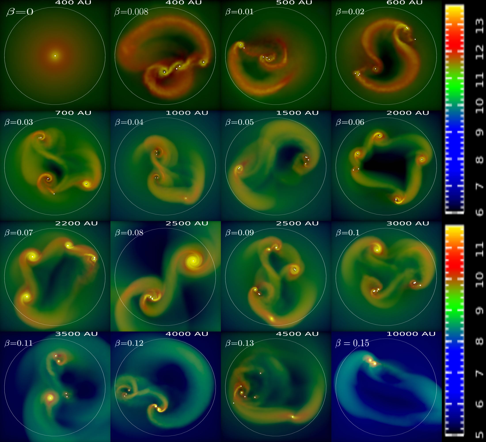
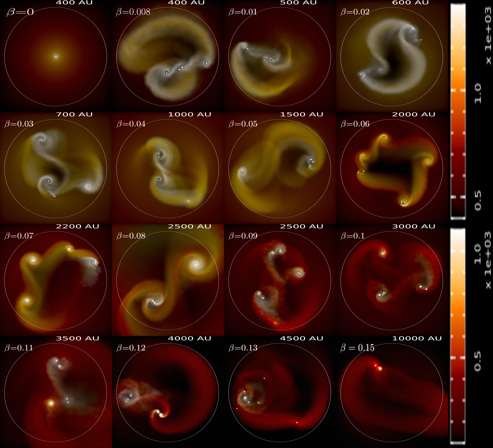

# Gadget2_polysink

## Modified Version of Cosmological simulation code Gadget2 with polytropic EOS, sink particles and constant external pressure boundaries.

+ The following images show the disk fragmentation in primordial gas clouds for different degrees of rotation. The rotation parameter $\beta$ is the ratio of rotational energy to the gravitational energy of the cloud.

Videos for some simulations can be found at the folliwing [link](https://www.youtube.com/watch?v=OAVzvZCopAI&list=PLEsVP16ISIIfigm7YLgIy4Cf14TGJ1UeE). Check out the file "manuscript.pdf" in current repository for detailed report. 

