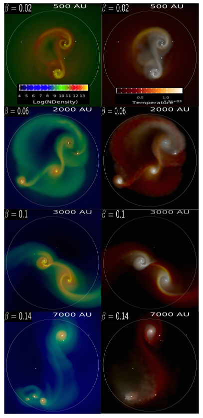

# Gadget2_polysink

## Modified Version of Cosmological simulation code Gadget2 with polytropic EOS, sink particles and constant external pressure boundaries.

+ The code can be used for simulating gravothermal collapse, fragmentation and consequent sink formation with polytropic equation of state. The following images show the fragmentation in primordial gas clouds for different degrees of rotation. The rotation parameter $\beta$ is the ratio of rotational energy to the gravitational energy of the cloud.      

Videos for all of the simulations can be found at the folliwing [link](https://www.youtube.com/watch?v=OAVzvZCopAI&list=PLEsVP16ISIIfigm7YLgIy4Cf14TGJ1UeE). Check out the file "report.pdf" in current repository for detailed report. 

